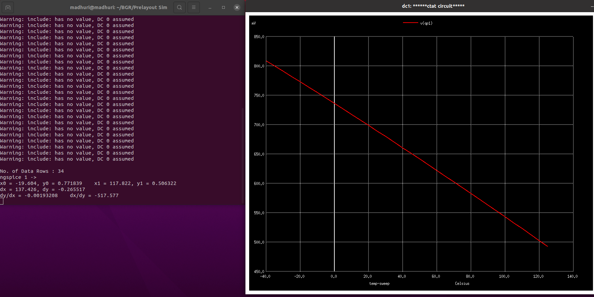

# VSDOpen21_Workshop_BGR_sky130
This github repository is for the design and simulation of a Analog Band Gap Reference Circuit (BGR) implemented with Google-skywater130nm technology PDK.

## Introduction to BGR
The Bandgap Reference (BGR) is a circuit which gives a constantv DC output voltage also called as reference voltage which is independent of supply voltage variation and temperature variation.
<p align="center">
  
</p>


### Why BGR 
- A battery is not suitable to use as a reference voltage source as it's voltage reduces with time
  
- A typical power supply gives noisy output or ripple superimposed in dc so it is also not suitable 
  
- An use of voltage reference IC with buried Zener diode, requires additional components and high frequency filtering circuits
  
- Unavaibility of low voltage zener diode

**Solution**
- Ease of integration of Bangap reference wthn bulk CMOS, Bi-CMOS or Bipolar technologies without the use of  external components makes it suitable to use it as refernce voltage generator.

### Features of BGR
- Reference voltage generation is independent of temperatue variation, Power supply variation and circuit loading
- Low Output voltage of 1.2v (close to the band gap energy of silicon at 0 deg kelvin)
- It finds applications in analog, digital, mixed mode, RF and system-on-chip (SoC).

### Applications of BGR
- Low dropout regulators (LDO)
- DC-to-DC buck converters
- Analog-to-Digital Converter (ADC)
- Digital-to-Analog Converter (DAC)


## Contents
- [1. Tool and PDK Setup](#1-Tools-and-PDK-setup)
  - [1.1 Tools Setup](#1.1-Tools-setup)
  - [1.2 PDK Setup](#1.2-PDK-setup)
- [2. BGR introduction](#2-BGR-introduction)
  - [2.1 BGR Principle](#2.1-BGR-Principle)
  - [2.2 Types of BGR](#2.2-Types-of-BGR)
  - [2.3 Self-biased Current Mirror based BGR](#2.3-Self-biased-current-mirror-based-bgr)
- [3. Design and Prelayout Simulation](#3-Design-and-Prelayout-Simulation)
- [4. Layout Design](#Layout-design)


## 1. Tools and PDK setup

### 1.1 Tools setup
For the design and simulation of the BGR circuit we will need the following tools.
- Spice netlist simulation - [Ngspice]
- Layout Design and DRC - [Magic]
- LVS - [Netgen]

#### 1.1.1 Ngspice 


[Ngspice](http://ngspice.sourceforge.net/devel.html) is the open source spice simulator for electric and electronic circuits. Ngspice is an open project, there is no closed group of developers.

[Ngspice Reference Manual][NGSpiceMan]: Complete reference manual in HTML format.

**Steps to install Ngspice** - 
Open the terminal and type the following to install Ngspice
```
$  sudo apt-get install ngspice
```
#### 1.1.2 Magic


 [Magic](http://opencircuitdesign.com/magic/) is a VLSI layout tool.
 
**Steps to install Magic** - 
 Open the terminal and type the following to install Magic
```
$  wget http://opencircuitdesign.com/magic/archive/magic-8.3.32.tgz
$  tar xvfz magic-8.3.32.tgz
$  cd magic-8.3.28
$  ./configure
$  sudo make
$  sudo make install
```
#### 1.1.3 Netgen


[Netgen] is a tool for comparing netlists, a process known as LVS, which stands for "Layout vs. Schematic". This is an important step in the integrated circuit design flow, ensuring that the geometry that has been laid out matches the expected circuit.

**Steps to install Netgen** - Open the terminal and type the following to insatll Netgen.
```
$  git clone git://opencircuitdesign.com/netgen
$  cd netgen
$  ./configure
$  sudo make
$  sudo make install 
```
### 1.2 PDK setup

A process design kit (PDK) is a set of files used within the semiconductor industry to model a fabrication process for the design tools used to design an integrated circuit. The PDK is created by the foundry defining a certain technology variation for their processes. It is then passed to their customers to use in the design process.

The PDK we are going to use for this BGR is Google Skywater-130 (130 nm) PDK.


**Steps to download PDK** - Open the terminal and type the following to download sky130 PDK.
```
$  git clone https://github.com/RTimothyEdwards/open_pdks.git
$  cd open_pdks
$  ./configure [options]
$  make
$  [sudo] make install
```

## 2. BGR Introduction

### 2.1 BGR Principle
The working principle of BGR circuits is to add a voltage with negative temprature coefficient to another voltagw with positive temperature coefficient. Generally semiconductor diode gives a voltage with negative temp coefficient and behave as CTAT. A PTAT circuit exactly works opposite to that of CTAT giving positive temp coefficient. So when these two voltages are added gives a constant voltage reference with respect to temp.

<p align="center">
  
</p>

#### 2.1.1 CTAT Voltage Generation
Usually semiconductor diodes provides -ve temco of voltage with value -2mV/deg Centigarde. i.e. CTAT behaviour.  
<p align="center">
  
</p>

#### 2.1.2 PTAT Voltage Generation
<p align="center">
  
</p>


So to get a PTAT Voltage generation circuit we have to separate VT from Is. It can be obtained as shown below

<p align="center">
  
</p>

In the above circuit same amount of current I is flowing in both the branches. So the node voltage A and B are going to be same V. Now in the B branch if we substract V1 from V, we get Vt independent of Is.
<p align="center">
  
</p>


From above we can see that the voltage V-V1 is PTAT in nature with very less slope as compared to the CTAT. In order to cancel the opposite slope magnitude of slope must be equal. So diode connected multiple BJTs are used resulting in small current with each dipode and hence results into ith eincrese in slope of V-V1.

<p align="center">
  
</p>

### 2.2 Types of BGR
Based on Architecture there are two types

- Using Self-biased current mirror  
- Using Operational-amplifier 

Based  on Application BGR can be classified as
- Low-voltage BGR
- Low-power BGR
- High-PSRR and low-noise BGR
- Curvature compensated BGR

We are going to design our BGR circuit using Self-biased current mirror architecture.

### 2.3 Self-biased current mirror based BGR

The Self-biased current mirror based BGR consists of following components.

- CTAT voltage generation circuit
- PTAT voltage generation circuit
- Self-biased current mirror circuit
- Reference branch circuit
- Start-up circuit

#### 2.3.1 CTAT Voltage generation circuit
The CTAT Voltage generation circuit consist of a diode connected BJT which gives CTAT nature as discussed above.

<p align="center">
  
</p>

#### 2.3.2 PTAT Voltage generation circuit
The PTAT Voltgae generation circuit consist of multiple i.e. **N** BJTs diode connected with a series resistance. 
<p align="center">
  
</p>

#### 2.3.3 Self-Biased Current Mirror Circuit
This doesn't need any external biasing circuit. It biases itself so called as Self biased ckt. 

<p align="center">
  
</p>

#### 2.3.4 Reference Branch Circuit
The reference circuit branch adds CTAT and PTAT volages and gives the final reference voltage which is constant. 

<p align="center">
  
</p>

#### 2.3.5 Start-up circuit
The start-up circuit is acting as a trigger to the self biased current mirror. It helps the transition from degenerative bias point (zero current) to the desired operation point i.e. desired current value mode. 

<p align="center">
  
</p>

#### 2.3.6 Complete BGR Circuit
All the above components are connected together finally to get the complete BGR circuit.

<p align="center">
  
</p>


## 3. Design and Pre-layout Simulation
This ciruit has been designed by using open source Google's Skywater 130nm technology PDK. The design requirements are as follows.

### 3.1 Design Requirements
- Supply voltage = 1.8V
- Temperature: -40 to 125 Deg Cent.
- Power Consumption < 60uW
- Off current < 2uA
- Start-up time < 2us
- Tempco. Of Vref < 50 ppm


### 3.2 Device Data Sheet
***1. MOSFET***
| Parameter | NFET | PFET |
| :-: | :-: | :-: |
| **Type** | LVT | LVT |
| **Voltage** | 1.8V | 1.8V |
| **Vt0** | ~0.4V | ~-0.6V |
| **Model** | sky130_fd_pr__nfet_01v8_lvt | sky130_fd_pr__pfet_01v8_lvt |

***2. BJT (PNP)***
| Parameter | PNP | 
| :-: | :-: | 
| **Current Rating** | 1uA-10uA/um2 | 
| **Beta** | ~12 |
| **Vt0** | 11.56 um2 | 
| **Model** | sky130_fd_pr__pnp_05v5_W3p40L3p40 |

***3. RESISTOR (RPOLYH)***
| Parameter | RPOLYH | 
| :-: | :-: | 
| **Sheet Resistance** | ~350 Ohm | 
| **Tempco.** | 2.5 Ohm/Deg Cent |
| **Bin Width** | 0.35u, 0.69u, 1.41u, 5.37u | 
| **Model** | sky130_fd_pr__res_high_po |


#### 3.3.1 Final Circuit
<p align="center">
  
</p>

### 3.4 Pre-layout simulation

Various .sp files in the repo are simulated using ngspice on local machine and results are as follows .


#### 3.4.1 CTAT Simulation

**CTAT Voltage generation with single BJT** [netlist](/prelayout/ctat_ckt.sp)

 To launch the simulation open terminal and write the following command in the prelayout folder.
```
$ ngspice ctat_ckt.sp
```

After simulation we can get a wavefrom like below, and from the wavefrom we can see the CTAT behaviour i.e. -ve temco of voltage. 
<p align="center">
  
</p>

**CTAT Voltage generation with Multiple BJT** [netlist](/prelayout/ctat_mul_bjt.sp)

In this simulation we will check the CTAT voltage across the 8 parallel connected BJTs.
<p align="center">
  
</p>

As we can see the increasing slope in case of multiple BJTs giving +temco.

**CTAT Voltage generation with different current source values** [netlist](prelayout/ctat_cur_var.sp)

In this simulation we will check the CTAT voltage dependancy on current.
<p align="center">
  
</p>

We can find that the voltage is decreasing with decrease in current value.

#### 3.4.2 PTAT Simulation

**PTAT Voltage generation with VCVS** [netlist](/prelayout/ptat_ckt.sp)


<p align="center">
  
</p>


#### 3.4.4 BGR using Ideal OpAmp

Now after simulating all our components, let's quick check our BGR behaviour using one VCVS as an ideal OpAmp. [netlist](/prelayout/bgr_ckt.sp)

In this simulation we should get the reference voltgae as an umbrella shaped curve and it should be ~1.2V.
<p align="center">
  
</p>

#### 3.4.5 BGR with SBCM

Now we will replace the ideal Op-Amp with self-biased current mirror which is our proposed design. We expect same type of output as in case of ideal OpAmp based BGR. We will also check for different corners, and will see how our circuit is performing in different corners.

- Behaviour in TT corner [netlist](/prelayout/bgr_cur_mir_tt.sp)
<p align="center">
  
</p>

Tempco. Of Vref = ~21.7 PPM

- Behaviour in FF corner [netlist](/prelayout/bgr_cur_mir_ff.sp)
<p align="center">
  
</p>

Tempco. Of Vref = ~10 PPM

- Behaviour in SS corner [netlist](/prelayout/bgr_cur_mir_ss.sp)
<p align="center">
  
</p>

Tempco. Of Vref = ~45 PPM

## 4. Layout Design

Layout of the final circuit has been drawn in Magic layout editor.

### 4.1 Getting started with Magic

Magic is an open source VLSI layout editor tool. To launch magic open terminal and write the following command.
```
$ magic -T /home/<path for sky130A.tech>/sky130A.tech 
```

Now let's start with all leaf cell designs.
### 4.2 Basic Cell Design

#### 4.2.1 NFET Layout
 In our circuit we are using LVT type NFETs. So we have to draw all the valid layers for the lvt nfet as per our desired sizes.

In our design we have used two different size nfets:

1. W=5 L=1 [mag file](/layout_files/nfet.mag)

<p align="center">
  
</p>

2. W=1 L=7 [mag file](/layout_files/nfet1.mag)

<p align="center">
  
</p>

#### 4.2.2 PFET layout
In our circuit we are using LVT type PFETs. So we have to draw our PFET using all valid layers for lvt pfet. In our design we have one size pfet i.e W=5 L=2 [mag file](/layout_files/pfet.mag)

<p align="center">
  
</p>

#### 4.2.3 Layout of Resistor
In our desing we are using poly resistors of W=1.41 and L=7.8. So we have to create the magic file choosing the appropriate layers for the Resistor. [mag file](/layout_files/res1p41.mag)

<p align="center">
  
</p>

#### 4.2.4 Layout of PNP (BJT)
In our design we are using PNP having emitter 3.41 * 3.41 uM.So we can use the valid layers to design our PNP. [mag file](/layout_files/pnpt1.mag)

<p align="center">
  
</p>

### 4.3 Blocks Layout Design

#### 4.3.1 Layout of NFETs

<p align="center">
  
</p>

#### 4.3.2 Layout of PFETs
We have created a PFETs block by putting all the pfets together, with matching arrangement, also added the guardring. [mag file](/layout_files/pfets.mag)

<p align="center">
  
</p>

#### 4.3.3 Layout of RESBANK
We have cretaed the layout of the RESBANK by putting all resistors together, with proper matching arrangemment and soe extra dummies and a guardring. [mag file](/layout_files/resbank.mag)
<p align="center">
  
</p>

#### 4.3.4 Layout of PNP10
We have created the layout by putting all the PNPs together, with appropriate matching, and used dummies to enhance noise performance. [mag file](/layout_files/pnp10.mag)
<p align="center">
  
</p>

#### 4.3.5 Layout of STARTERNFET
We placed the the two w=1, l=7 NFETs together with a guardring to desingn the STATRTERNFET. [mag file](/layout_files/starternfet.mag)
<p align="center">
  
</p>

## 4.4 Top level layout
To obtain the top level design, we have placed all the blocks together, routed it. [mag file](/layout_files/top.mag)
<p align="center">
  
</p>


## Acknowledgement

I would like to thank Prof. [Santunu Sarangi](https://in.linkedin.com/in/santunu-sarangi-b731305b) and Prof. [Saroj Rout](https://www.linkedin.com/in/sroutk/) to explain the bandgap IP design from scratch with detailed discussion on design procedure, Prelayout simulation and Postlayout simulation. Also would like to thank  Mr. Kunal Ghosh and Ms. Anagha Ghosh from [VSD](https://www.vlsisystemdesign.com/) to provide VSD-IAT platform.

## References
https://github.com/google/skywater-pdk

https://skywater-pdk.readthedocs.io/en/latest/rules.html

https://github.com/RTimothyEdwards/netgen.git

https://github.com/vsdip/vsdopen2021_bgr.git

